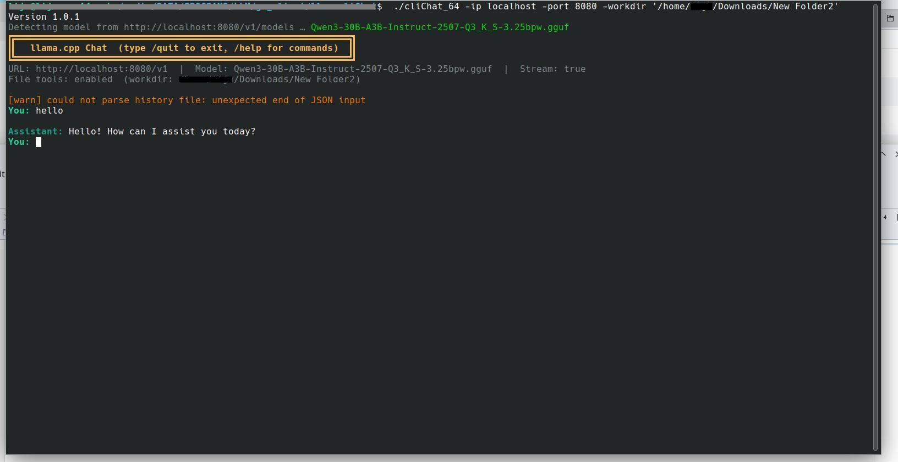

# Agentic llama.cpp command line Chat client 



A command-line chat client for llama.cpp and OpenAI-compatible servers, with agentic file-system tools. This is a very lightweight client.It can be used with llama server running on your PC.

## Features
- Chat with local or remote LLM servers (OpenAI API compatible)
- Streaming and non-streaming responses
- Agentic file-system tools (list, read, write, append, move, delete, search, grep)
- Conversation history persistence
- Multiline prompt can be typed by typing `\` at the end of a line
- Customizable system prompt

## Usage
```
go build -o cmdchat main.go
./cmdchat -ip <server_ip> -port <server_port> [options]
```

### Example
```
./cmdchat -ip 127.0.0.1 -port 8080
```

### Options
- `-ip`         : llama.cpp server IP address (default: 10.11.0.9)
- `-port`       : llama.cpp server port (default: 8089)
- `-key`        : API key (optional)
- `-model`      : Model name (default: auto-detect)
- `-system`     : System prompt (default: "You are a helpful assistant.")
- `-temp`       : Temperature (default: 0.7)
- `-max`        : Max tokens (default: 0)
- `-nostream`   : Disable streaming
- `-notools`    : Disable file-server tools
- `-workdir`    : Root directory for file tools (default: cwd)

### In-chat commands
- `/quit`      : Exit
- `/clear`     : Clear conversation
- `/history`   : Show conversation history
- `/workdir`   : Show current working directory
- `/help`      : Show help

## File Tools
When enabled, the assistant can use these tools:
- `list_dir`                : List directory contents
- `read_file`               : Read file contents
- `write_file`              : Overwrite file
- `append_file`             : Append to file
- `create_dir`              : Create directory
- `delete_path`             : Delete file or directory
- `move_path`               : Move/rename file or directory
- `search_files_with_name`  : Search for files/dirs by glob pattern
- `search_file_contents`    : Grep files for regex pattern
- `get_workdir`             : Show working directory
- `edit_file_lines`         : To edit selected lines in a file
- `run_command`             : to run bash command


## Additional MCP servers

Addition MCP stdio servers can be configured in ~/.clichat/mcp-config.json . Sample content is given below
```
{
  "tools": {
    "mcpServers": {
      "myRAG":{
        "command":"pathto__mcp_server",
        "args":["argument1"]
      }
    }
  }
}
```

## Additional Instructions
Additional instructions to enhance system prompt can be mentioned in '.instructions' file in the working directory. Restart the program to take effect.


## Building
Requires Go 1.18+.

```
go build -o cmdchat main.go
```

## License
MIT
